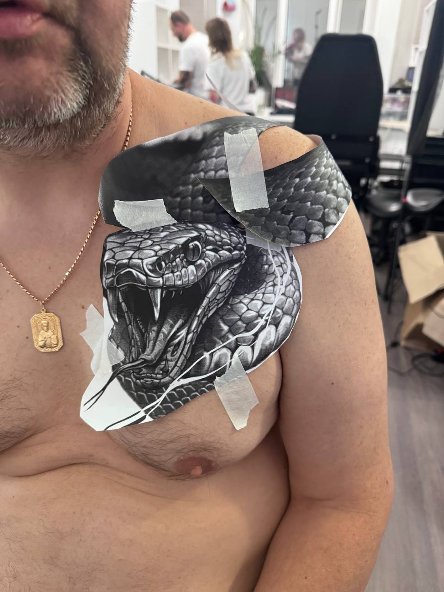
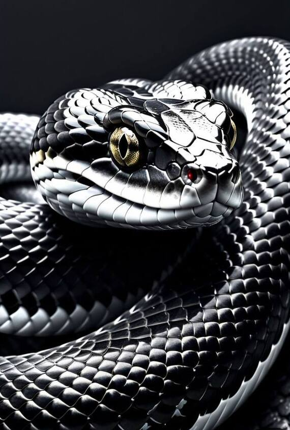
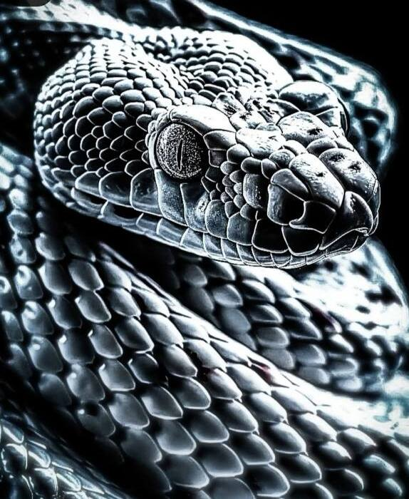

# Змея: изгибы тела и чешуя

Разбор эскиза и задание на доработку. 23.09.2026.

Исходники — в каталоге проекта: `eskiz-na-tele.jpg` (эскиз на теле),
`primer-2-chisto.jpg` и `primer-3-chisto.jpg` (примеры 2 и 3, обрезанные от
интерфейса телефона — их удобно показывать мастеру и загружать в редактор).

*Эскиз на теле. Голова проработана, тело через плечо идёт полосой ровной ширины.*

*Примеры 2 и 3. Слева — перехлёст витков и падающие тени, справа — блик на
каждой чешуйке и смена её размера поперёк тела.*

---

## 1. Что уже хорошо

Голова сделана на том же уровне, что и примеры: щитки темени разного размера,
надбровный валик, щелевидный зрачок, клыки, мягкая растушёвка в глубине пасти.
Её трогать не нужно — доработка касается **только тела**.

---

## 2. Почему тело выглядит плоским

Три причины, все поправимые.

**Тело идёт лентой постоянной ширины.** Через дельтовидную мышцу оно проходит
почти прямой полосой одинаковой толщины — и читается как ремень, а не как живая
змея. В примерах 2 и 3 ни один виток не сохраняет ширину: тело то полнеет, то
уходит в тень, то сужается, уходя за соседний виток.

**Нет перехлёста.** В примерах тело минимум трижды пересекает само себя, и в
каждом пересечении видно, какой виток сверху: верхний даёт на нижний собственную
падающую тень. Это главный источник глубины. На эскизе перехлёста нет — есть
полоса через плечо и отдельный виток на груди.

**Чешуя одного размера и слабого контраста.** На эскизе чешуйки мелкие и ровные
по всему телу. В примерах размер чешуи меняется вдвое-втрое: крупная по хребту,
мелкая к краю витка, и у каждой чешуйки свой блик.

---

## 3. Что конкретно взять из примеров 2 и 3

### Блик на каждой чешуйке

Главный приём. Каждая чешуйка в примерах — это не контур, а три тона:

| Часть чешуйки | Тон | Доля площади |
|---|---|---|
| Блик по верхнему краю | чистая кожа, без пигмента | 15–20 % |
| Тело чешуйки | средний серый | 55–60 % |
| Тень под нижним краем | плотный чёрный | 20–25 % |

Блик идёт **серпом по верхнему краю**, повторяя форму чешуйки, а не пятном по
центру. Именно он даёт ощущение влажной, глянцевой кожи. Без него чешуя остаётся
узором.

### Ряды чешуи идут по диагонали

В примерах ряды лежат под углом примерно **35° к оси тела**, ромбической сеткой,
а не поперёк. И сетка живёт вместе с изгибом: на **внутренней** стороне поворота
ряды сжимаются (чешуйки короче на треть-половину), на **внешней** — растягиваются.
Это то, что читается как «тело гнётся», а не «на тело наклеили узор».

### Размер чешуи меняется поперёк тела

По хребту — самые крупные. К краю витка размер падает примерно вдвое, а сами
чешуйки разворачиваются почти в профиль и сливаются в тёмную полосу. Число
чешуй в ряду при этом постоянно.

### Свет с одной стороны и отражённый снизу

Во всех примерах один источник света, сверху-слева. На каждом витке:

1. по верхнему краю — светлая кромка;
2. чуть ниже — самая глубокая тень витка (не по нижнему краю, а именно под
   серединой);
3. по самому нижнему краю — **снова средний серый**, отражённый свет.

Третий пункт пропускают чаще всего, а он и делает тело круглым. Если нижний край
витка уходит в чистый чёрный, тело схлопывается в плоскую ленту.

### Подбрюшные щитки

В примере 2 хорошо видно: там, где змея повёрнута брюхом, мелкая чешуя сменяется
широкими поперечными пластинами. Светлая полоса щитков рядом с тёмным боком —
дешёвый и очень заметный контраст.

---

## 4. Задание на композицию

Голова остаётся на месте и в том же развороте. Тело перекладывается так:

**От шеи — вверх и вправо, через дельтовидную.** Не прямой полосой, а дугой,
повторяющей округлость мышцы: толще всего сразу за шеей, к плечу немного тоньше.

**На пике дельтовидной — перехлёст.** Витку, идущему на спину, дать пройти
**поверх** витка, уходящего вниз, с падающей тенью 4–6 мм. Это главная точка
композиции: при движении рукой виток будет выглядеть затягивающимся.

**Вниз по груди — второй, более широкий виток.** Сейчас он обрезан краем бумаги
на уровне соска. Нужно решение: либо тело уходит дугой обратно к грудине, либо
продолжается по рёбрам. От этого зависит общий размер работы — **вопрос к вам**.

**Хвост** — тонким сбегом, с постепенно мельчающей чешуёй, без резкого обрыва.

---

## 5. Поправки на кожу

Печатный эскиз всегда выглядит контрастнее, чем заживший чёрно-серый тату.

- **Блики оставлять чистой кожей**, без единого прохода. Разбавленный серый на
  месте блика через год станет ровным фоном, и объём пропадёт.
- **Тени класть плотнее, чем на бумаге** — чёрно-серое за год-два теряет заметную
  часть контраста.
- **Чешуйка мельче 3 мм на груди сольётся.** На снимке видно, что зона с
  волосяным покровом; мелкая проработка там читаться не будет. На груди чешую
  делать крупнее, чем на плече.
- Общее правило: чем меньше работа, тем крупнее чешуя. Детализация примеров 2 и
  3 — это макросъёмка, один к одному она на тело не переносится.

---

## 6. Задание для нейросети

Если доработка идёт через редактор с ИИ (в примерах 2 и 3 стоит пометка
«Изменено с помощью ИИ» — значит, инструмент под рукой есть), режим —
**img2img**: основа — эскиз, сила изменения 0,5–0,65, чтобы голова уцелела.
Примеры 2 и 3 — как образец стиля.

**По-русски:**

> Чёрно-серая реалистичная тату: гадюка с раскрытой пастью и клыками. Голову
> оставить без изменений. Тело переложить плавными округлыми витками,
> перехлёстывающими друг друга, с падающими тенями в местах пересечения.
> Крупная глянцевая чешуя ромбическими рядами по диагонали к оси тела; на каждой
> чешуйке яркий серповидный блик по верхнему краю и плотная тень под нижним.
> Крупная чешуя по хребту, мельче к краям витков. Широкие светлые подбрюшные
> щитки там, где видно брюхо. Один источник света сверху-слева, отражённый свет
> по нижнему краю витков. Чистый белый фон, без цвета.

**По-английски** (для Midjourney и Stable Diffusion):

> black and grey realism tattoo design, viper with open mouth and fangs, keep the
> head unchanged, body re-posed into smooth overlapping coils crossing over
> itself with cast shadows at the crossings, large glossy keeled scales in
> diagonal diamond rows at 35 degrees to the body axis, each scale with a bright
> crescent highlight on its upper edge and deep shadow beneath, scales largest
> along the spine and smaller toward the coil edges, wide pale ventral scutes
> where the belly shows, single light source upper left, reflected light along
> the lower edge of each coil, clean white background, no colour, high contrast

Ставить в отрицательный запрос: `flat, uniform scale size, outline only, colour,
blurry, low contrast`.

---

## 7. Открытый вопрос

Куда уходит нижний виток — обратно к грудине или вниз по рёбрам? Ответ задаёт
размер всей работы и его нужно получить до того, как мастер переложит тело.
